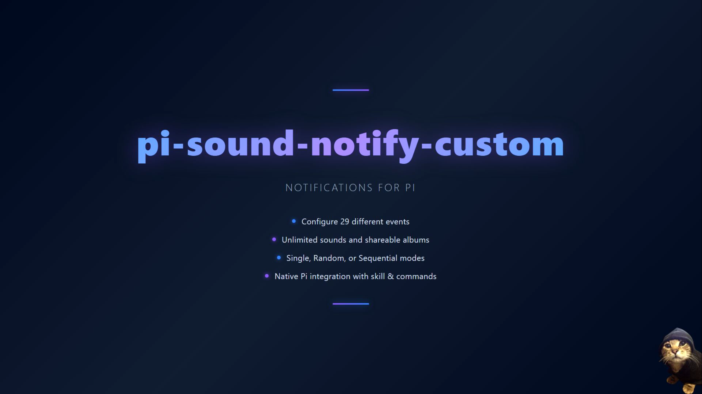

# 🎵 Pi Sound Notify Custom



[](https://www.npmjs.com/package/@john95ac/pi-sound-notify-custom) [](LICENSE) [](https://pi.dev/packages) [](https://patreon.com/John95ac) [](https://ko-fi.com/john95ac)

---

## Overview

Assign sounds to Pi events. A session starts? Play a chime. A tool fails? Play an error tone. Agent finishes responding? Play a completion sound. Everything configurable via `sounds.json`  no code changes needed.

I built this because working in silence sucks. Sound feedback tells you when Pi is thinking, when it finishes, and when something breaks. without stealing focus or opening windows.

---

## Video Presentation

https://github.com/user-attachments/assets/9640d532-82e9-4c4d-a1f9-c6093202626d

---

## Features

- **29 events** → from `session_start` to `model_select`
- **4 play modes** → single, random, sequential, disabled
- **Album system** → organize sounds in subfolders, switch between packs
- **Cross-platform** → Windows, Linux/WSL, macOS
- **Focus-safe** → no window steal, no popups
- **Real-time config** → edit `sounds.json`, changes apply instantly
- **Interactive selectors** → pick sounds and albums from the chat
- **Status bar** → see your active album at a glance

---

## Install

```bash
pi install npm:@john95ac/pi-sound-notify-custom
```

The postinstall script automatically sets up `~/.pi/agent/sound/` with a starter pack (`sounds.json` + `Basic/*.wav`). Run `/reload` and you're set.

---

## Quick Start

Edit `~/.pi/agent/sound/sounds.json`:

```json
{
  "enabled": true,
  "creator": "John95ac",
  "album": "Basic",
  "album_emoji": "🎵",
  "album_visible": true,
  "events": {
    "session_start": {
      "mode": "random",
      "sounds": ["Basic/miau-PDA.wav", "Basic/finger-snap.wav"]
    },
    "agent_end": {
      "mode": "single",
      "sounds": ["Basic/ding-small-bell-sfx.wav"]
    },
    "tool_execution_error": {
      "mode": "single",
      "sounds": ["Basic/robot_talk.wav"]
    }
  }
}
```

### Modes

| Mode           | Behavior                              |
| -------------- | ------------------------------------- |
| `single`     | Always plays the first sound          |
| `random`     | Picks one randomly every time         |
| `sequential` | Rotates in order (1, 2, 3, 1, 2, 3…) |
| `disabled`   | Silent -- nothing plays               |

### Albums

Organize sounds in subfolders:

```
~/.pi/agent/sound/
  sounds.json              ← master config
  Basic/
    miau-PDA.wav
    ding-small-bell-sfx.wav
    sounds-Basic.json      ← album config
  MyPack/
    startup.wav
    error.wav
    sounds-MyPack.json
```

Reference sounds as `"Basic/miau-PDA.wav"` or `"MyPack/startup.wav"`.

---

## Commands

| Command                        | Action                                                             |
| ------------------------------ | ------------------------------------------------------------------ |
| `/sound-play [file.wav]`     | Play a sound. No arg = interactive selector (Enter=play, Esc=exit) |
| `/sound-hub-banner`          | Toggle album banner in status bar (visible/hidden)                 |
| `/sound-config`              | Enable or disable the entire plugin                                |
| `/sound-album-select`        | Switch album interactive selector with preview                  |
| `/sound-album-select <name>` | Switch to a specific album by name                                 |
| `/sound-help`                | Show complete help and documentation                               |

---

## How It Works

1. **Install** → postinstall script copies `sounds.json` + `Basic/*.wav` to `~/.pi/agent/sound/`
2. **Session start** → plugin reads `sounds.json`, plays the configured sound
3. **Events** → Pi fires events (`agent_end`, `tool_execution_error`, etc.), plugin matches them to sounds
4. **Config changes** → `fs.watchFile` detects edits to `sounds.json`, reloads automatically
5. **Commands** → use `/sound-*` commands to control everything from chat

---

## Compatibility

| System | Description | Status |
|--------|-------------|--------|
| Windows | PowerShell SoundPlayer | Designed natively on this platform the system I use the most |
| Linux / WSL | aplay (ALSA) or paplay (PulseAudio) | Works inside WSL. Should be functional across different Linux distros too |
| macOS | afplay → | I'm literally a cat I don't have money for a Mac. But from what I researched, afplay should work |

### Requirements

- **Node.js** >= 20
- **Pi Coding Agent** (any version with extension support)
- **`.wav` files only** no mp3, ogg, or flac

---

## License

MIT © 2026 [John95ac](https://github.com/John95ac)

If this plugin helps you, consider [buying me a coffee](https://ko-fi.com/john95ac) or [supporting on Patreon](https://patreon.com/John95ac).
